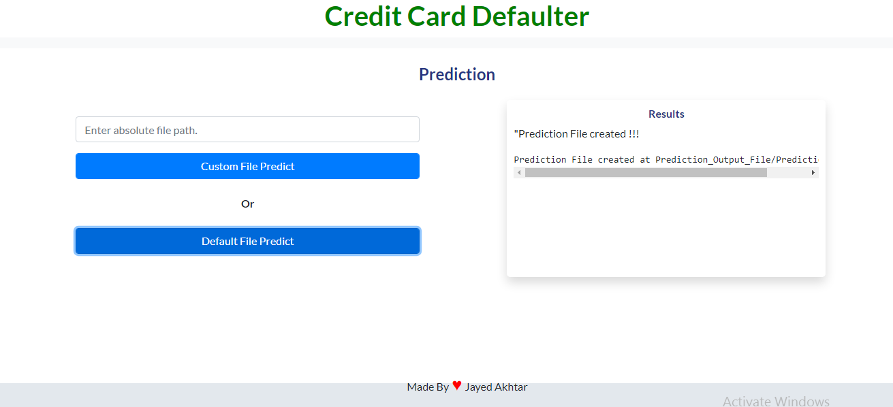

# CreditCardDefaulter
# Problem Statement
Problem Statement is to build such a model which identifies weather a customer is going default for the credit card payment or not.
##### why it is necessary to identifies defaulter:
There are several ways in which Bank earn their money. Most of the money earn by the bank are from interest charge on the credit given to different customer.
 From this Problem Statement bank is trying to forecast of what will be the InFlow of money that they are going to recieved.
 Based in this model Bank will see which customer is going to Pay or Default.

### Defaulter means:   
People who do not pay their due they are called as defaulters from the Bank.
# Some screenshots of the app
* About Project Architecture:

* Landing Page:

* Prediction Page:

# How to run this app
* First create a virtual environment by using this command:
* conda create -n myenv python=3.6
* Activate the environment using the below command:
* conda activate myenv
* Then install all the packages by using the following command
* pip install -r requirements.txt
* Now for the final step. Run the app
* python app.py

